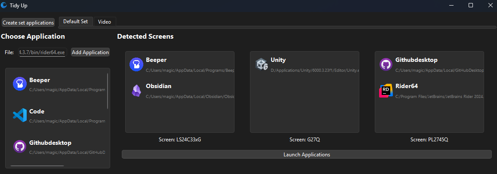
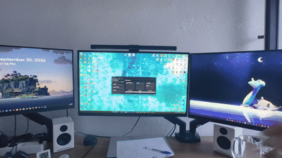

<p align="center">
  
</p>

# TidyUp

TidyUp is a small Windows application, made with Python and PyQt6, that opens a set of applications and places each one on the screen of your choice automatically.

<p align="center">
  
  <br>
  <i>Example window of the app</i>
</p>

## How to use it

The window is split in two parts. On the left, there is the list of the applications you added. On the right, there are the screens detected on your computer, displayed in the same order as in the Windows display settings (from left to right).

1. Click on **Add Application** and select the `.exe` file of the application.
2. Drag the application from the list and drop it on a screen.
3. Click on **Launch Applications**. Each application is opened, then moved to its screen and maximized.

A right click on an application gives some options: change the name displayed, add a project path, or remove it.

The applications can be grouped in sets, one set per tab, for example one for work and one for gaming. A new set is created with **Create set applications**, and a right click on a tab allows to rename or close it. Each tab keeps its own list of applications and its own screens.

<p align="center">
  
  <br>
  <i>Launch demo of open multiple applications on 3 screens</i>

Everything is saved automatically when a tab is created, changed, renamed or closed, and when the application is closed. Thus, the next time TidyUp is opened, the tabs and the applications are back as they were.

## How it works

The main difficulty of the project is to find the right window after an application is launched. The first version searched the window by its title, but it was not reliable: the title of a browser is the name of the page, and another window, like a folder with the same name, could be taken instead.

Now, TidyUp looks at the process that owns each window. A window is linked to an application if its process is the `.exe` of the application, or if it was started by it. This second case is needed for some applications: for example, the window of Steam belongs to `steamwebhelper.exe` and not to `steam.exe`, and GitHub Desktop starts a second `.exe` located in a sub folder before closing the first one.

When the window is found, it is moved to the screen and maximized using the Win32 API through `pywin32`. Some applications, like VS Code or Obsidian, restore their own last position just after opening, which cancels the move. So TidyUp keeps checking the window for a few seconds and moves it again if needed. If an application is already running, it is not opened a second time, its window is only moved.

All of this runs in a separate thread, so the interface stays responsive during the launch. The status of each application is displayed under the button, and the launch can be stopped at any time with the same button.

The settings are stored with `QSettings`, in the Windows registry under `HKEY_CURRENT_USER\Software\M4gico\TidyUp`.

## Python installation

TidyUp only works on Windows, because it relies on the Win32 API to move the windows. It was developed with Python 3.13.

```
git clone https://github.com/M4gico/TidyUp.git
cd TidyUp
python -m venv .venv
.venv\Scripts\activate
pip install -r requirements.txt
```

Then, from the root folder of the project:

```
python -m Scripts.main
```

## Known limitations

- Applications opened through a launcher with a different `.exe` name (like the `Update.exe` of Discord) can't be recognized.
